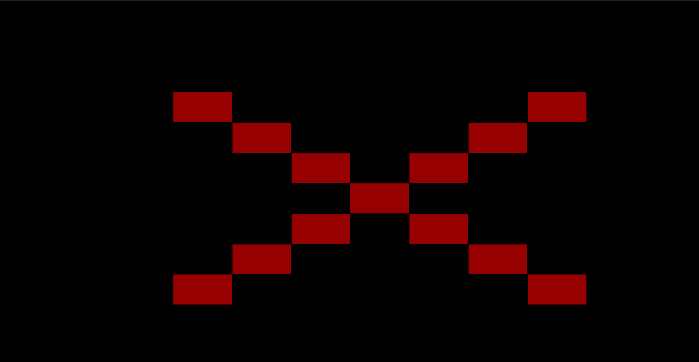
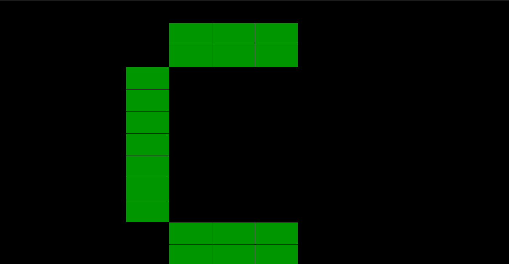

# Last Pattern Game Simulator

Jogo Desenvolvido para Simulador de Mesa LED 12x12

## Como funciona:

* Aparecerão dois padrões, você deve identificar qual deles era o padrão errado do caso anterior
* 



* O primeiro padrão que deve ser selecionado é um Retangulo


## Como compilar e executar esse codigo?

```
./comp.sh exemplo.cpp exemplo 
./exemplo 
```
## Mais informações sobre o simulador

[Simulador](https://github.com/cacauvicosa/inf351_2019/tree/master/trabalhos/t3/Arthur/simulador)
